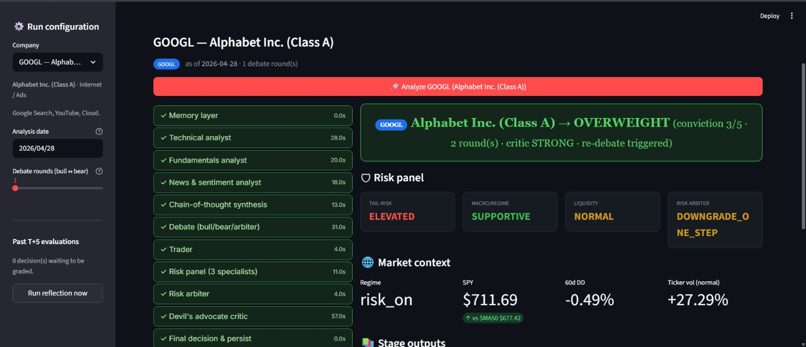
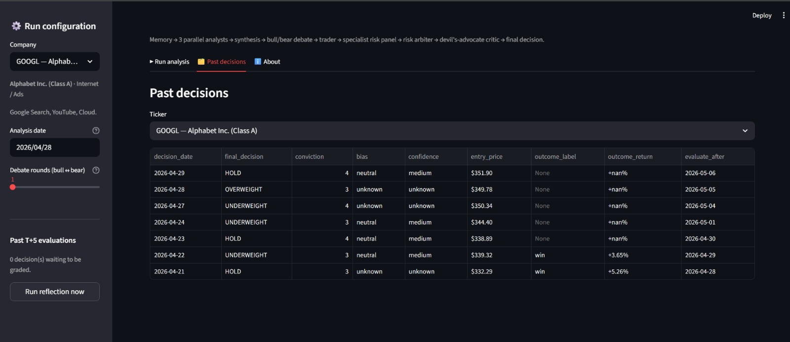

<div align="center">

# 🤖 Multi-Agent Trading Intelligence System

*Decomposed market analysis across parallel specialized agents — unified into a single explainable trading decision.*


</div>


## Description

This project implements a **multi-agent trading intelligence system** that analyzes financial markets using specialized agents and combines their reasoning into a unified, explainable trading decision.

The system decomposes the analysis problem into a full pipeline of **13 specialized agents** across five stages: memory retrieval, parallel market analysis, structured debate, risk management, and post-decision reflection. Each agent is responsible for a distinct dimension of the pipeline — no single model carries the full reasoning burden.

The pipeline produces a final decision of **BUY / OVERWEIGHT / HOLD / UNDERWEIGHT / SELL** with a conviction score, risk verdicts from three specialist analysts, and a complete per-stage output log. Every decision is persisted to a SQLite database and automatically evaluated at T+5 trading days via a reflection agent.

---

## Architecture

### Full Pipeline Flow

```
        Input: Ticker Symbol + Analysis Date + Debate Rounds
                             │
                             ▼
┌──────────────────────────────────────────────────────────────┐
│                        Memory Agent                          │
│  Retrieves past 5 decisions for the ticker from SQLite DB    │
│  Formats historical context → injected into analyst prompts  │
└──────────────────────────────────────────────────────────────┘
                             │
                             ▼
┌──────────────────────────────────────────────────────────────┐
│                   Parallel Analyst Layer                     │
│                                                              │
│  ┌──────────────┐  ┌──────────────┐  ┌───────────────────┐  │
│  │  Technical   │  │ Fundamental  │  │  News + Sentiment  │  │
│  │   Analyst    │  │   Analyst    │  │      Analyst       │  │
│  │  [yfinance]  │  │ [SEC EDGAR]  │  │  [Alpha Vantage]   │  │
│  └──────────────┘  └──────────────┘  └───────────────────┘  │
│         All three run concurrently via LangGraph             │
└──────────────────────────────────────────────────────────────┘
                             │
                             ▼
┌──────────────────────────────────────────────────────────────┐
│                   CoT Synthesis Agent                        │
│  Aggregates all three analyst reports                        │
│  Identifies agreement and conflict across signals            │
│  Produces provisional bias (bullish / bearish / neutral)     │
└──────────────────────────────────────────────────────────────┘
                             │
                             ▼
┌──────────────────────────────────────────────────────────────┐
│                       Debate Layer                           │
│                                                              │
│   ┌────────────────┐  ←── N rounds ───→  ┌───────────────┐  │
│   │  Bull Research │                     │ Bear Research │  │
│   │     Agent      │                     │     Agent     │  │
│   └────────────────┘                     └───────────────┘  │
│                           ↓                                  │
│          ┌─────────────────────────────────┐                 │
│          │         Neutral Arbiter         │                 │
│          │  Scores evidence, rigor, and    │                 │
│          │  rebuttal quality (1–5 each)    │                 │
│          │  Flags contradictions           │                 │
│          └─────────────────────────────────┘                 │
└──────────────────────────────────────────────────────────────┘
                            │
                            ▼
┌──────────────────────────────────────────────────────────────┐
│                       Trader Agent                           │
│  Sees bull + bear arguments and arbiter verdict              │
│  Also receives memory context from past decisions            │
│  Outputs: BUY / OVERWEIGHT / HOLD / UNDERWEIGHT / SELL       │
│  Assigns conviction score 1–5                                │
└──────────────────────────────────────────────────────────────┘
                            │
                            ▼
┌──────────────────────────────────────────────────────────────┐
│                  Specialist Risk Panel                       │
│                                                              │
│  ┌───────────────┐  ┌────────────────┐  ┌────────────────┐  │
│  │  Tail-Risk    │  │  Macro/Regime  │  │   Liquidity    │  │
│  │   Analyst     │  │    Analyst     │  │    Analyst     │  │
│  │ (drawdown     │  │ (market regime │  │ (microstructure│  │
│  │  scenarios)   │  │  context)      │  │  execution)    │  │
│  └───────────────┘  └────────────────┘  └────────────────┘  │
│                           ↓                                  │
│          ┌─────────────────────────────────┐                 │
│          │          Risk Arbiter           │                 │
│          │  Synthesizes 3 risk specialists │                 │
│          │  May downgrade trader call if   │                 │
│          │  2+ specialists raise alarms    │                 │
│          └─────────────────────────────────┘                 │
└──────────────────────────────────────────────────────────────┘
                            │
                            ▼
┌──────────────────────────────────────────────────────────────┐
│               Devil's-Advocate Critic Agent                  │
│  Reads the full pipeline transcript                          │
│  Finds the strongest reason the decision could be wrong      │
│  Rates challenge strength: WEAK / MODERATE / STRONG          │
│                                                              │
│     If STRONG → triggers one full re-debate round            │
│     (Bull + Bear + Arbiter → Trader → Risk Panel again)      │
│     If WEAK or MODERATE → passes through unchanged           │
└──────────────────────────────────────────────────────────────┘
                              │
                              ▼
┌──────────────────────────────────────────────────────────────┐
│                   Final Decision + Persist                   │
│  Saves decision to SQLite with entry price, conviction,      │
│  bias, confidence, all agent outputs, and T+5 eval date      │
└──────────────────────────────────────────────────────────────┘
                              │
                              ▼
┌──────────────────────────────────────────────────────────────┐
│                    Reflection Agent (T+5)                    │
│  Fires automatically 5 trading days after each decision      │
│  Fetches realized return at T+5                              │
│  Writes post-mortem analysis back to memory DB               │
│  Labels outcome: win / loss / flat                           │
└──────────────────────────────────────────────────────────────┘
```

---

## ✅ Implemented Agents

### 🧠 Memory Agent
- Retrieves the past 5 decisions for the requested ticker from SQLite
- Formats them as a historical context block (date, decision, conviction, outcome)
- Injects context into analyst and trader prompts without anchoring

### 📈 Technical Analyst
- Fetches 180 days of price data via yfinance
- Computes RSI(14), MACD, Bollinger Bands, VWAP(20d), volume z-score, and 52-week range
- Generates a step-by-step technical analysis report via LLM

### 📊 Fundamental Analyst
- Pulls structured financial data from SEC EDGAR (revenue, earnings, assets, liabilities, equity, EPS)
- Analyzes 4-year trends
- Generates a fundamental outlook (bullish / bearish / neutral) via LLM

### 📰 News + Sentiment Analyst
- Fetches 50 recent articles via Alpha Vantage
- Applies recency weighting so newer articles have greater impact
- Aggregates sentiment metrics and actionable catalysts via LLM

### 🔗 CoT Synthesis Agent
- Summarizes each analyst's directional view
- Identifies agreement and conflict across the three reports
- Produces a provisional bias, confidence level, and trader-facing takeaway

### 🐂 Bull Researcher
- Constructs the strongest long thesis anchored to analyst signals
- Rebuts bear arguments directly in each debate round
- Responds to critic challenges if re-debate is triggered

### 🐻 Bear Researcher
- Constructs the strongest short or avoid thesis
- Addresses the bull's strongest claims in each round
- Responds to critic challenges if re-debate is triggered

### ⚖️ Neutral Arbiter
- Scores bull and bear on evidence quality, rigor, and rebuttal strength (1–5 each)
- Flags contradictions and unsupported claims
- Renders a verdict (bull / bear / tie) with strength (strong / moderate / weak)

### 📉 Trader Agent
- Synthesizes bull, bear, and arbiter outputs together with memory context
- Outputs one of: BUY / OVERWEIGHT / HOLD / UNDERWEIGHT / SELL
- Assigns conviction score 1–5 with supporting rationale

### ⚠️ Tail-Risk Analyst
- Assesses extreme drawdown scenarios and worst-case bias
- Outputs: ELEVATED / MODERATE / LOW

### 🌍 Macro / Regime Analyst
- Evaluates current market regime and broader macro context
- Outputs: HOSTILE / MIXED / SUPPORTIVE

### 💧 Liquidity Analyst
- Evaluates execution microstructure conditions
- Outputs: STRESSED / NORMAL / AMPLE

### 🛡️ Risk Arbiter
- Synthesizes all three risk specialist verdicts
- Downgrades the trader's call by one step if 2+ specialists raise alarms

### 😈 Devil's-Advocate Critic
- Reads the complete pipeline transcript after the risk arbiter
- Identifies the strongest single reason the current decision could be wrong
- Rates challenge strength: WEAK / MODERATE / STRONG
- If STRONG, triggers one full re-debate round (Bull + Bear + Arbiter → Trader → Risk Panel)

### 🔍 Reflection Agent (T+5)
- Evaluates decisions whose 5-trading-day window has elapsed
- Fetches realized price return
- Writes a post-mortem analysis and updates the memory DB with outcome and label

---

## 🖥️ UI

The system includes a **Streamlit web dashboard** (`app.py`) with live agent execution status, per-stage output tabs, a risk panel, and a past decisions browser.





---

## Input / Output

### Input

Any valid stock ticker supported by yfinance and Alpha Vantage:
```bash
python main.py AAPL
python main.py TSLA
python main.py NVDA
```

### CLI Output


---

## 🚀 Setup and Installation

### Prerequisites

- **Python 3.10 or above**

### Dependencies

| Package | Purpose |
|:--------|:--------|
| `langgraph` | Agent graph orchestration |
| `langchain` | LLM abstractions |
| `langchain-google-genai` or `langchain-openai` | LLM provider |
| `yfinance` | Market price data |
| `pandas` | Data processing |
| `numpy` | Numerical computation |
| `requests` | HTTP calls |
| `python-dotenv` | Environment variable management |
| `streamlit` | Web UI |

### Installation

**1. Clone the repository**
```bash
git clone 
```

**2. Create and activate a virtual environment**
```bash
python -m venv env

# macOS / Linux
source env/bin/activate

# Windows
env\Scripts\activate
```

**3. Install dependencies**
```bash
pip install -r requirements.txt
```

### Environment Setup

Create a `.env` file in the project root:

```env
LLM_PROVIDER=google
LLM_MODEL=gemini-2.5-flash
GOOGLE_API_KEY=your_google_api_key
ALPHAVANTAGE_API_KEY=your_alpha_vantage_api_key
```

The system supports multiple LLM providers:

| Provider | LLM_PROVIDER value | Key to set |
|:---------|:-------------------|:-----------|
| Google Gemini (default) | `google` | `GOOGLE_API_KEY` from [Google AI Studio](https://aistudio.google.com/) |
| OpenAI | `openai` | `OPENAI_API_KEY` from [OpenAI](https://platform.openai.com/api-keys) |
| Anthropic | `anthropic` | `ANTHROPIC_API_KEY` from [Anthropic Console](https://console.anthropic.com/) |

---

## ▶️ Running the Project

### CLI
```bash
python main.py AAPL
```
Replace `AAPL` with any valid ticker (e.g. `TSLA`, `MSFT`, `NVDA`, `GOOG`).

### Web UI (Streamlit)
```bash
streamlit run app.py
```
Opens at `http://localhost:8501`. Select a company, pick an analysis date, set debate rounds, and click **Analyze**.

---

## 🧪 Running Tests

```bash
python -m pytest Tests/ -v
```

All tests use mocked LLMs, market data, EDGAR, and news APIs — no real API calls or keys required.
